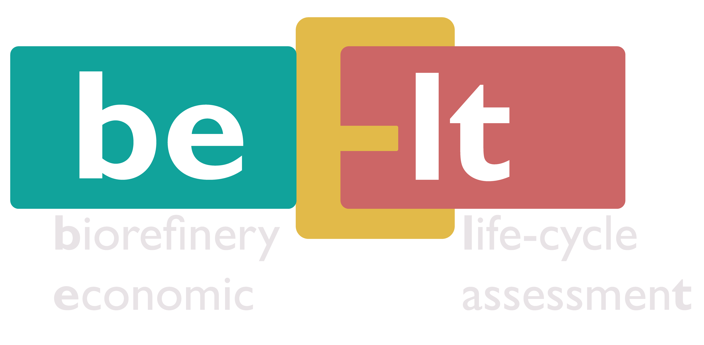

<p align="center">
  
</p>

# agile ATJ 

This package provides an open-source modular framework for Sustainable Aviation Fuel (SAF) production via the  Alcohol-to-Jet (ATJ) pathway.


# Installation
For first time users, it is recommended to create a virtual environment.
On anaconda prompt in Windows, create and activate a venv using the following commands:

Create a venv
```bash
conda create -n pyfuel python=3.10 # you can name it whatever you want
conda activate pyfuel
```

Change the working directory to where you'd want to clone the repository
```bash
cd C:\Users\...
```

Clone the repository
```bash
git clone https://github.com/H-Wadgama/ATJ.git
cd ATJ # redirects to the root folder
```

Install required packages 
```bash
pip install -r requirements.txt
```

If you want to develop the package, install in editable mode:
```bash
pip install -e .
```

## Simulate the baseline biorefinery
```bash
python -m atj_saf.main
```
This simulates a stream summmary, and the MJSP


## Contributing
Pull requests are welcome. For major changes, please open an issue first to discuss what you'd like to change.

## Questions
Feel free to reach out on [**LinkedIn**](https://www.linkedin.com/in/hafiwadgama/).


```bash
git clone https://github.com/H-Wadgama/ATJ.git
cd atj_saf
pip install -e .
